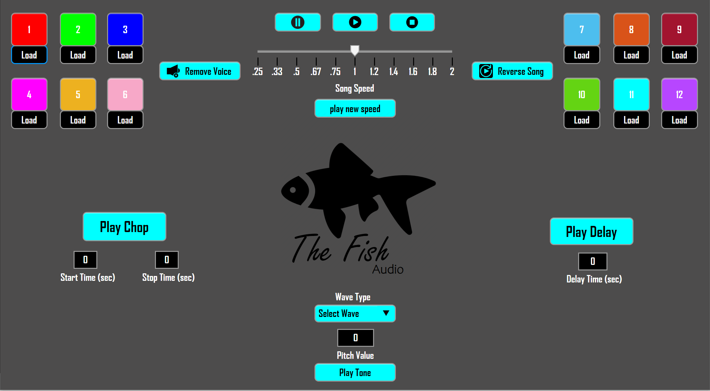

# The Fish - Audio Sampler

In this project, I created a basic audio sampler Graphical User Interface. It models some of today’s 
commercial hardware based audio samplers from companies like Akai, Native Instruments, Roland, etc. The sampler can load up to 12 different songs, play them in any desired order, play a chop of the song, play the song in reverse, remove the voice from the song, speed up/slow down the song, delay the start of the song, and generate either a sin, square, or triangle wave at any desired pitch (for tuning an instrument).
### Prerequisites
* You will need to have MATLAB installed on your device. For most university students, you can download for free with the following link, and if you are not a university student, you can download a free 30 day trial at this link as well.
  - [MATLAB Instillation Instructions](https://www.mathworks.com/campaigns/products/trials.highResolutionDisplay.html)
## Running the tests
* First, open MATLAB and select the yellow '+' symbol with the word 'New' written under it from the top left part of the ribbon interface. From the drop-down menu, select 'App'. The App Designer will open, and from here, select the 'Open' button and select the Audio Sampler app from the directory that you saved it in. (NOTE: If you rename the app, it cannot contain any spaces, only letters and underscores.)
* Next, you will need to intstall .wav files onto your computer to use with the audio sampler. I could not upload any of mine to GitHub because they were too big, so you will have to find a way to install you own. The .wav files MUST be saved in the directory as follows: Documents > MATLAB. The audio sampler will not be able to load the songs if they are not saved to this directory.
* Once the .wav files are installed, you can go back into the App Designer and select the green arrow titled 'Run', located in the ribbon interface. The app will then pop up in a separate window titled 'UI Figure.' The app is now usable. 
* To use the app, you must first load in anywhere from one to twelve songs. To do so, click on one of the 'load' buttons found beneath the boxes labeled 1-12, and select the desired song to load into this slot. You can do this for just one of the boxes, or for all 12 of the boxes.
* Once the songs are loaded, click on the box above the load button to play the song in that slot. The play/pause buttons can be used on the song in question, and the stop button will restart the song. 
* If you would like to use any of the effects on the song, then you can do so simply. Whatever song is playing at the time is the song that will have the effects performed on it. To remove voice, simply click the 'Remove Voice' button. To reverse the song, simply click the 'Reverse Song' button. To play the song at a new speed, drag the slider to the desired speed, then select 'play new speed'. To play a choped portion of the song, enter the time (in seconds) that you wish for the chop to start at, the time (in seconds) that you wish for the chop to stop at, then select 'Play Chop' and that portion of the song will be played. To delay the start of the song, simply enter the time (in seconds) that you wish for the song to be delayed, then press 'Play Delay', and you will hear the song start the user-defined number of seconds later.
* The pure tone is not an effect that can be used on the songs themselves, it is simply a tool that can be used to tune an instrument. To use this feature, select the desired wave type for the tone from the drop-down menu, enter the frequency that you would like to play the wave at, in Hz, then select 'Play Tone'. 
* These effects can be used on any of the loaded songs, and new songs can be loaded into any of the boxes at any time. Enjoy!
## Authors
* **William Schmidt** - [Wil's LikedIn](https://www.linkedin.com/in/william-schmidt-152431168/)
